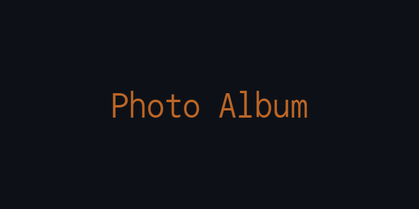
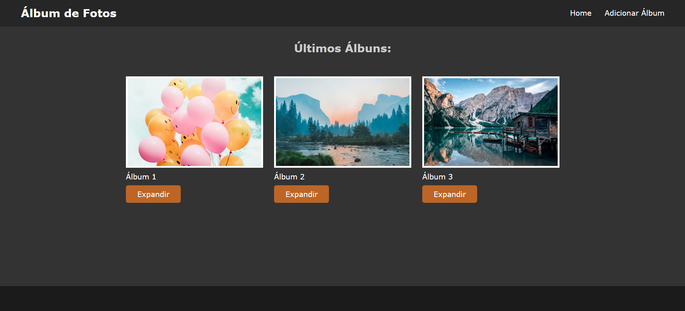

<p align="center">
  
</p>

## Overview

- This is a fullstack project for a web application that allows users to create photo albums
- Users can add comments to existing albums
- Built using React, Vite, Axios, Nodemon and MongoDB Atlas

<p align="center">
  
</p>

## Set Up MongoDB Atlas

This project use MongoDB Atlas as database:
1. Create a [MongoDB Atlas](https://www.mongodb.com/cloud/atlas) account
2. Create a new cluster
3. Add your IP address to the IP whitelist in the cluster settings
4. Create a new database user with a username and password

## Installation and Usage

To view this project locally, follow these steps:
1. Install [Node.js and NPM](https://nodejs.org/en/download/package-manager)
2. Clone the repository:
   ```bash
   git clone https://github.com/GiuliaFreulon/photo-album
   cd photo-album
3. Install the dependencies:
- In the backend directory
   ```bash
   cd backend
   npm install nodemon --save-dev
- In the frontend directory
   ```bash
   cd ../frontend
   npm install
4. Go to the file named .env in the backend directory
5. Replace <username> and <password> with your MongoDB credentials:
   ```plaintext
   DBUSER=<username>
   DBPASS=<password>
6. Start the Application:
- In the backend directory
   ```bash
   cd backend
   npm start
- In the frontend directory
   ```bash
   cd ../frontend
   npm run dev
7. Open the localhost link that will appear in the terminal

## License

This project is licensed under the MIT License. See the [LICENSE](LICENSE) file for details.
